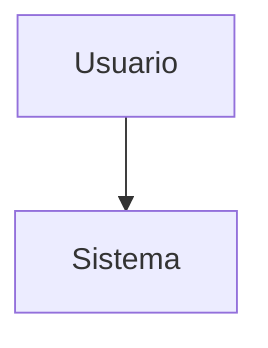
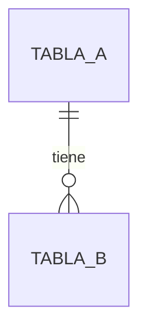
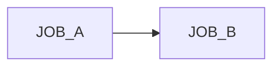

# [PLANTILLA] Documento Técnico — [Sistema]

| Campo | Valor |
|---|---|
| Sistema | |
| Versión | 0.1 (borrador) |
| Autor | |
| Validado por (TI) | |
| Fecha | |
| Estado | Borrador / En revisión / Aprobado |

## 1. Arquitectura general
<!-- Diagrama de contexto (C4 nivel 1) + descripción -->

## 2. Componentes
| Componente | Tecnología | Responsable | Descripción |
|---|---|---|---|
| | | | |

## 3. Integraciones e interfaces
| Origen | Destino | Mecanismo | Datos | Frecuencia |
|---|---|---|---|---|
| | | | | |

## 4. Base de datos
### 4.1 Diagrama ER

### 4.2 Tablas
| Tabla | Propósito | Campos críticos | Relaciones |
|---|---|---|---|
| | | | |

## 5. Procesos batch y jobs
| Job | Horario | Depende de | Entrada | Salida | Códigos de retorno |
|---|---|---|---|---|---|
| | | | | | |

### Cadena de ejecución

## 6. APIs
<!-- Resumen por endpoint; detalle en OpenAPI -->
| Endpoint | Método | Consumidor | Descripción | Errores conocidos |
|---|---|---|---|---|
| | | | | |

## 7. Operación y soporte
- Logs: ubicación y herramienta de consulta
- Monitoreo:
- Despliegue:
- Contactos de escalamiento:

## 8. Riesgos y puntos críticos
| Riesgo | Impacto | Mitigación actual | Estado |
|---|---|---|---|
| | | | |
