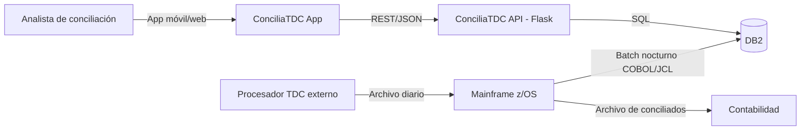
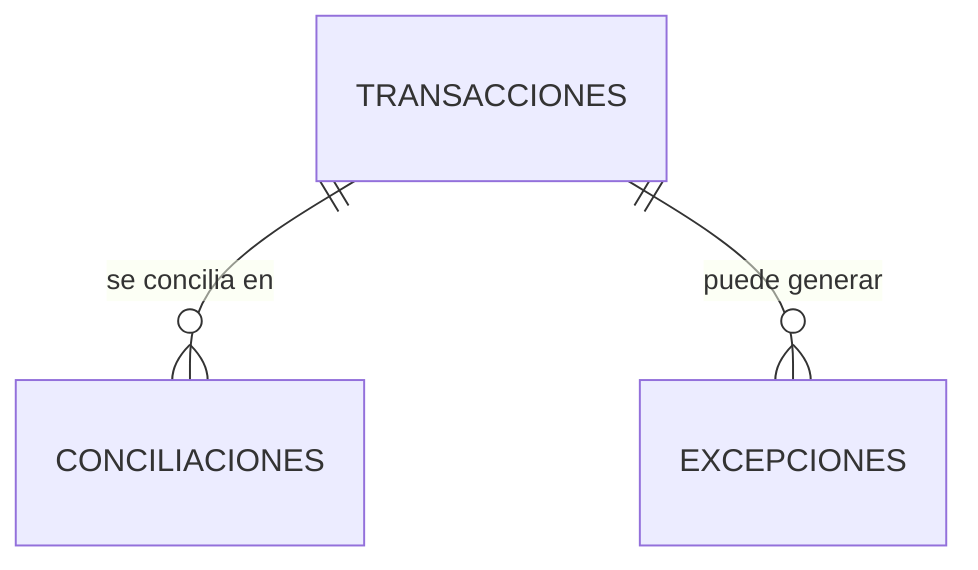
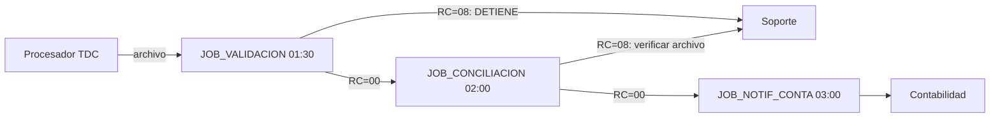

# Documento Técnico — ConciliaTDC

| Campo | Valor |
|---|---|
| Sistema | ConciliaTDC |
| Versión | 1.0 |
| Estado | Aprobado (ejemplo de referencia) |

## 1. Arquitectura general (C4 — Nivel 1: Contexto)

## 2. Componentes

| Componente | Tecnología | Responsable | Descripción |
|---|---|---|---|
| App móvil/web | — | Desarrollo | Consulta de conciliaciones y reproceso de excepciones |
| API REST | Flask (Linux) | Mariana | Expone conciliaciones, excepciones y reproceso |
| Base de datos | DB2 | DBA | TRANSACCIONES, CONCILIACIONES, EXCEPCIONES |
| Batch de conciliación | COBOL CONCILI1 + JCL | Soporte | Proceso nocturno de conciliación |
| Scheduler | Control-M | Operaciones | JOB_VALIDACION → JOB_CONCILIACION → JOB_NOTIF_CONTA |

## 3. Integraciones e interfaces

| Origen | Destino | Mecanismo | Datos | Frecuencia |
|---|---|---|---|---|
| App | API | REST/JSON + token | Consultas, reprocesos | En línea |
| Procesador TDC | Mainframe | Archivo `BCT.PROD.TDC.TRANSAC.D<fecha>` | Transacciones del día | Diario 01:30 |
| Mainframe | DB2 | SQL embebido (COBOL) | Altas/actualizaciones de conciliación | Diario 02:00 |
| Mainframe | Contabilidad | Archivo `BCT.CTA.TDC.ENTRADA.D<fecha>` | Conciliados | Diario 03:00 |

## 4. Base de datos

### 4.1 Diagrama ER

### 4.2 Tablas

| Tabla | Propósito | Campos críticos | Relaciones |
|---|---|---|---|
| TRANSACCIONES | Transacciones reportadas por el procesador | ID (PK), MONTO, FECHA | Padre de las demás |
| CONCILIACIONES | Resultado por transacción | ESTATUS, DIFERENCIA, JOB_EJECUCION | FK → TRANSACCIONES |
| EXCEPCIONES | Diferencias pendientes de revisión | ESTATUS, ACCION, USUARIO_REVISA | FK → TRANSACCIONES |

> **Campo crítico:** `CONCILIACIONES.ESTATUS` lo escribe el COBOL CONCILI1 con
> valores CONCILIADA / AJUSTADA / EXCEPCION. Confirmar si existen valores
> históricos adicionales (pendiente con Mariana).

## 5. Procesos batch y jobs

| Job | Horario | Depende de | Entrada | Salida | RC conocidos |
|---|---|---|---|---|---|
| JOB_VALIDACION | 01:30 | — | Archivo del procesador | Log de validación | 00 OK / 08 archivo no llegó o mal formado |
| JOB_CONCILIACION | 02:00 | JOB_VALIDACION | Archivo del procesador | Conciliados, excepciones, update DB2 | 00 OK / 08 fallo en PASO01 |
| JOB_NOTIF_CONTA | 03:00 | JOB_CONCILIACION | Archivo de conciliados | Archivo a Contabilidad | — |

### Cadena de ejecución

## 6. APIs (resumen — detalle en `api/openapi.yaml`)

| Endpoint | Método | Consumidor | Descripción | Errores conocidos |
|---|---|---|---|---|
| /conciliaciones/{fecha} | GET | App | Conciliaciones del día | 401 token, 404 batch no corrió |
| /excepciones | GET | App | Excepciones por estatus | — |
| /reproceso | POST | App | ACEPTAR_DIFERENCIA / REPROCESAR | 409 ya procesada |

## 7. Operación y soporte

- **Logs:** spool del job, revisados con Control-M
- **Ventana crítica:** la cadena debe terminar antes de las 07:00
- **Runbooks:** RB-01 (batch no ejecutó), ver `runbook-batch.md`
- **Escalamiento:** Soporte L2 → Ricardo (L3) → Desarrollo (Mariana)

## 8. Riesgos y puntos críticos

| Riesgo | Impacto | Mitigación actual | Estado |
|---|---|---|---|
| Doble ejecución del batch duplica movimientos (INC-2019) | Alto | Validación manual verbal | ⚠ Sin automatizar |
| Conocimiento del batch concentrado en Ricardo | Alto | Este documento + runbook | ✓ En remediación |
| Refresh token falla tras 8 h (INC-1987) | Bajo | Re-login | Escalado a desarrollo |
